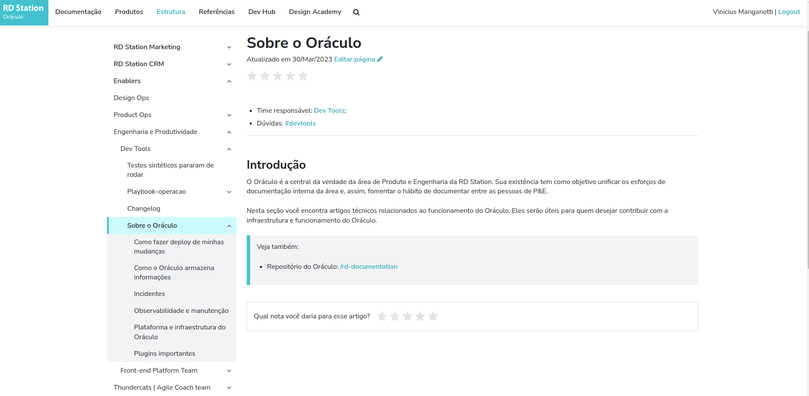

## Sumário

*   [**O time**](https://oraculo.rdstation.com.br/estrutura/times/enablers/dev-tools#o-time)
*   [**Canais no Slack**](https://oraculo.rdstation.com.br/estrutura/times/enablers/dev-tools#canais-no-slack)
*   [**Métricas**](https://oraculo.rdstation.com.br/estrutura/times/enablers/dev-tools#metricas)
*   [**Produtos gerenciados pelo time**](https://oraculo.rdstation.com.br/estrutura/times/enablers/dev-tools#produtos-gerenciados-pelo)
*   [**Roadmap 2022**](https://oraculo.rdstation.com.br/estrutura/times/enablers/dev-tools#roadmap-2022)
*   [**Pesquisas/Reports**](https://oraculo.rdstation.com.br/estrutura/times/enablers/dev-tools#pesquisas-reports)

---

## O time

O time é composto pelos seguintes membros

Teste 1
Teste 2
