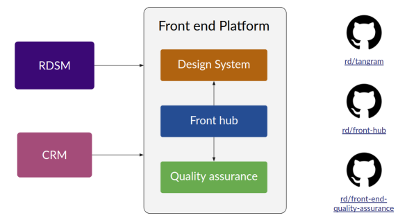

# Front-end Platform Team

O time é compostos por...

## Referências

Canal no Slack: [#team-frontend-platform](https://rdstation.slack.com/archives/C0198PW2PBR)

Conceitos e definições: [/referencias/front-end-architecture](https://oraculo.rdstation.com.br/referencias/front-end-architecture)

# Front end Platform

The Front end Platform comprises the Front hub, the Tangram Design System, and the Front end Quality Assurance. All of this form the RD Front end Architecture.

The RD Front end Architecture is a set of tools and processes that allow developers to create apps with agility, security, and quality in a standardized way.

